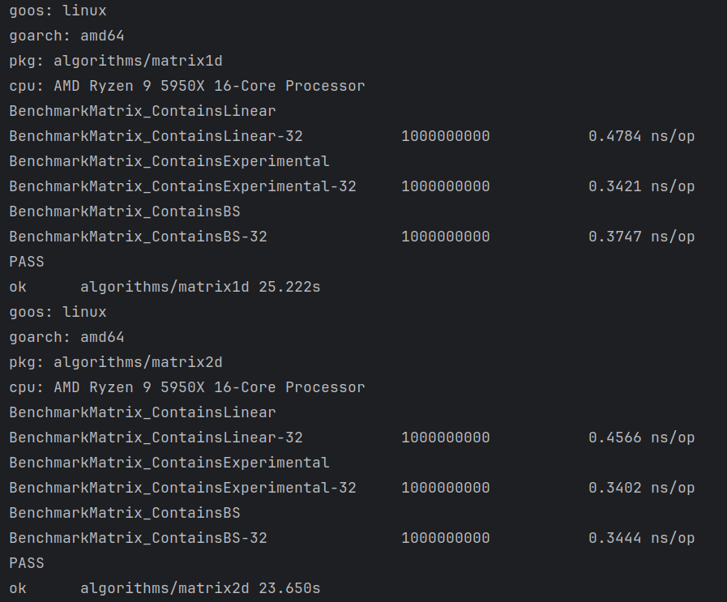

# Matrix search algorithms

## Problem
Finding an element in a non-decreasing matrix
Suppose we have a square matrix M of size n × n such that:
- Each element in the matrix is a positive integer.
- Each row is sorted in non-decreasing order.
- Each column is sorted in non-decreasing order.

We want to design an algorithm that decides whether a given integer x is in the matrix.
1. Suggest a naive algorithm to solve this problem in O(n^2) time.
2. Propose a divide-and-conquer algorithm to solve this problem in O(n log n) time.
3. Design an algorithm that solves this problem in O(n) time

## Solutions

### O(n^2)
*not implemented*

### O(n log n) (Binary Search) `matrix1d.go::ContainsBS`, `matrix2d.go::ContainsBS`
This algorithm uses binary search on each row of the matrix to find the target. 
It iterates through each row, performing a binary search to check if the target exists in that row. 
If the target is found, it returns the row and column indices. 
This approach ensures a time complexity of O(n log n).

### O(n) `matrix1d.go::ContainsLinear`, `matrix2d.go::ContainsLinear`
This algorithm starts from the top-right corner of the matrix and iteratively eliminates rows or columns. 
If the current element is larger than the target, it moves left to the next column. 
If the current element is smaller than the target, it moves down to the next row.
This approach ensures that each step reduces the search space, resulting in an O(n) time complexity. 
In the best case, we find the target after 1 comparison, in the worst case, we need 2n-1 comparisons.
See matrix1d.go::ContainsLinear.

### Experimental (Divide and Conquer) `matrix1d.go::ContainsExperimental`, `matrix2d.go::ContainsExperimental`
This algorithm uses a divide-and-conquer approach to search for the target in the matrix.
It divides the matrix into four quadrants and recursively searches each quadrant that could contain the target.
By leveraging the sorted properties of the matrix, it can quickly eliminate quadrants that cannot contain the target.
This approach ensures a time complexity of O(n log n).

#### Notes
- We found a fundamental flaw with the algorithm operating on the diagonals of the matrix which prevented us from restricting the search space effectively. 
  Therefore, we did not pursue this approach any further.
- Benchmarks show that our experimental approach is the fastest of the three algorithms, which is kind of surprising, 
  given that it has a worse time complexity than linear time, at least for our (small) n of 5'000.
- Binary Search also performs better than the linear time algorithm, at least for our (small) n of 5'000.
- Theoretical time complexity calculations are useful, but measuring in the real world can yield surprising results.
- We implemented all the algorithms on two slightly different data structures.
  The first one uses a 1d array (slice) to store matrix elements, the second one uses a 2d array (slice) to do so.
  Benchmarks show that using a 2d array (slice) is the faster option.

